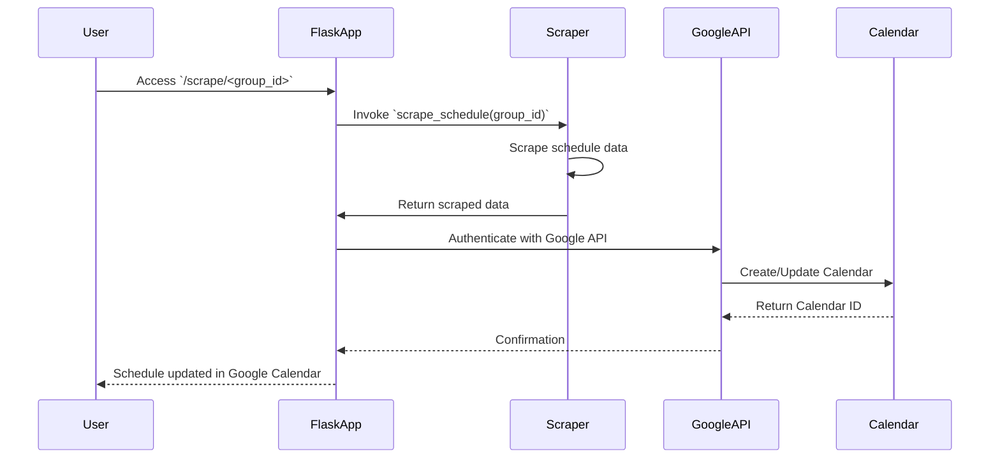

# Flask Google Calendar Scheduler

This project is an automated scheduling system built using Flask. It scrapes schedule data and integrates it with Google Calendar to create and update calendar events dynamically. The project also includes custom logging to track activities and errors, providing a robust solution for schedule management and Google Calendar integration.

## Project Structure

```plaintext
flaskProject-wat/
├── .venv/                  # Virtual environment directory (excluded in .gitignore)
├── logs/                   # Directory for storing log files
├── src/                    # Source code directory
│   ├── google_api/         # Google API related code
│   │   ├── __init__.py
│   │   └── update_google_calendar.py
│   ├── scraper/            # Scraper code for extracting schedule data
│   │   ├── __init__.py
│   │   └── scheduler_scraper.py
│   ├── utils/              # Utility scripts such as custom logging
│   │   ├── __init__.py
│   │   └── custom_logger.py
│   └── app.py              # Main entry point for the Flask application
├── .dockerignore           # Files and directories to ignore in Docker builds
├── .env                    # Environment variables (excluded in .gitignore)
├── .gitignore              # Files and directories to ignore in version control
├── credentials.json        # Google OAuth credentials file (excluded in .gitignore)
├── Dockerfile              # Docker configuration for containerization
├── README.md               # Project documentation (this file)
├── requirements.txt        # Python dependencies
└── token.json              # OAuth2 token file (excluded in .gitignore)
```

## Prerequisites

- Python 3.12.6 or higher
- Google Cloud Project with OAuth2 credentials (`client_id` and `client_secret`)
- `pip` and `virtualenv` for dependency management

## Setup and Installation

1. **Clone the Repository**:

   ```bash
   git clone https://github.com/yourusername/flask-google-calendar-scheduler.git
   cd flask-google-calendar-scheduler
   ```

2. **Create a Virtual Environment and Activate It**:

   ```bash
   python3 -m venv .venv
   source .venv/bin/activate  # On Windows use `.venv\Scripts\activate`
   ```

3. **Install Dependencies**:

   ```bash
   pip install -r requirements.txt
   ```

4. **Set Up Environment Variables**:

   Create a `.env` file in the root directory with the following content:

   ```ini
   FLASK_ENV=development
   GOOGLE_CLIENT_ID=your-google-client-id
   GOOGLE_CLIENT_SECRET=your-google-client-secret
   SCOPES=https://www.googleapis.com/auth/calendar
   TOKEN_FILE_PATH=./token.json
   CREDENTIALS_FILE_PATH=./credentials.json
   REDIRECT_URI=http://localhost:5000/oauth2callback
   LOG_DIR=./logs
   ```

5. **Set Up Google OAuth2 Credentials**:

   - Download the `credentials.json` file from the Google Cloud Console.
   - Place it in the root directory of the project.

6. **Run the Application**:

   ```bash
   flask run
   ```

### Docker Setup

1. **Build the Docker Image**:

   ```bash
   docker build -t flask-google-calendar-scheduler .
   ```

2. **Run the Docker Container**:

   ```bash
   docker run -p 5000:5000 --env-file .env flask-google-calendar-scheduler
   ```

## Usage

### Authenticate with Google

1. Open your browser and navigate to `http://localhost:5000`.
2. Authenticate using your Google account.
3. Grant the application permissions to access your Google Calendar.

### Scraping and Updating Calendar

- To scrape the schedule for a specific group, access the following URL pattern:

  ```
  http://localhost:5000/scrape/<group_id>
  ```

  Replace `<group_id>` with the desired group identifier.

- The application will automatically create or update calendar events based on the scraped schedule.

## Logging

Custom logging is configured using the `logging` library in `custom_logger.py`. Log files are stored in the `logs` directory. The logging includes different levels such as DEBUG, INFO, WARNING, ERROR, and CRITICAL.

### Log Levels and Colors

- **DEBUG**: Blue
- **INFO**: White
- **WARNING**: Yellow
- **ERROR**: Red
- **CRITICAL**: Bold Red

## Sequence Diagram

The following sequence diagram illustrates the interaction between different components of the application during the schedule scraping and calendar update process.



## Environment Variables

The application uses the following environment variables:

| Variable                | Description                                      |
|-------------------------|--------------------------------------------------|
| `FLASK_ENV`             | Set to `development` or `production`             |
| `GOOGLE_CLIENT_ID`      | OAuth2 Client ID for Google API                  |
| `GOOGLE_CLIENT_SECRET`  | OAuth2 Client Secret for Google API              |
| `SCOPES`                | API scopes required for Google Calendar          |
| `TOKEN_FILE_PATH`       | Path to the `token.json` file                    |
| `CREDENTIALS_FILE_PATH` | Path to the `credentials.json` file              |
| `REDIRECT_URI`          | OAuth2 redirect URI (e.g., `http://localhost:5000/oauth2callback`) |
| `LOG_DIR`               | Directory where log files will be stored         |

## Troubleshooting

- **OAuth2 Error**: If you encounter errors related to OAuth2, ensure that `credentials.json` is correctly configured and placed in the root directory.
- **Docker Issues**: If the Docker container fails to build or run, ensure that the `.env` file is correctly set up, and that the necessary files (e.g., `credentials.json`) are included in the build context.

## Contributing

Contributions are welcome! Please fork the repository, make your changes, and submit a pull request.

## License

This project is licensed under the MIT License.
```

### Key Improvements:
1. **Detailed Project Structure:** Reflecting your project tree.
2. **Environment Variables:** Added configuration details and recommendations for setting up environment variables.
3. **Sequence Diagram:** Explained the flow of data between the different components using a sequence diagram.
4. **Log Levels and Colors:** Explained how the custom logger differentiates between log levels using colors.

If you have any additional customization requests or want to include other details, let me know!
